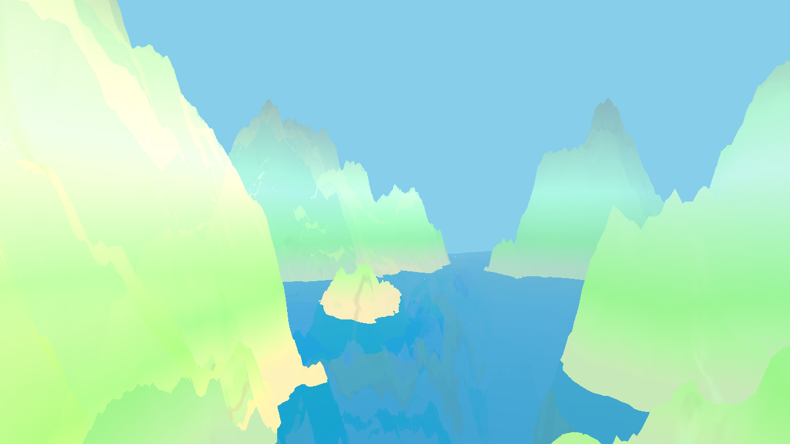

## Terrain and water simulation

## Video about the project
https://youtu.be/N6v7zOqLLkU

## Pictures
<p align="center">
  
  
</p>

## External Resources
  * Perlin K. "Improving Noise." Proceedings of the 29th annual conference on Computer graphics and interactive techniques. 2002.
  * https://blog.csdn.net/weixin_39634438/article/details/112237114

## Usage
```
cd part1
python3 build.py
./lab
```
